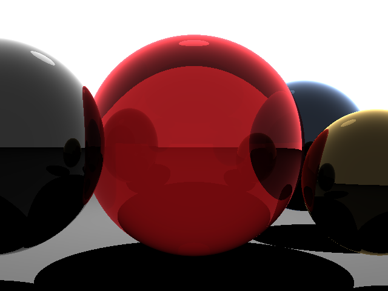
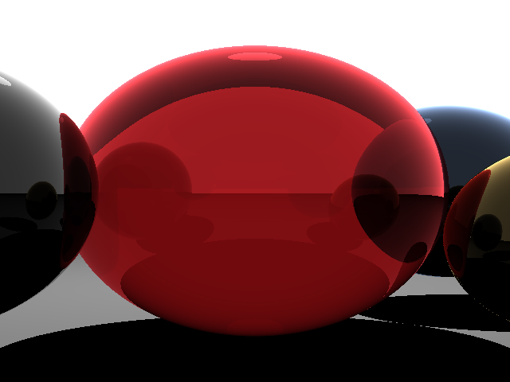

## Craptracing

So...I tried to port [this](https://www.scratchapixel.com/code.php?id=3&amp;origin=/lessons/3d-basic-rendering/introduction-to-ray-tracing&amp;src=0) raytracing example from C++ to C# to get a better grasp on the topic. But I failed. And I don't know why. I give up. Fuck you raytracing. Fuck you gamedevelopment. I'm out.

### Original version

So beautiful. So curvy. So reflective. So transparent. Marvellous.

### Craptracing version

I have tried debugging this for **4 hours**. Right now it is 3am on a Saturday and I don't want to do this anymore. I've got transparency to work but it still sucks.

